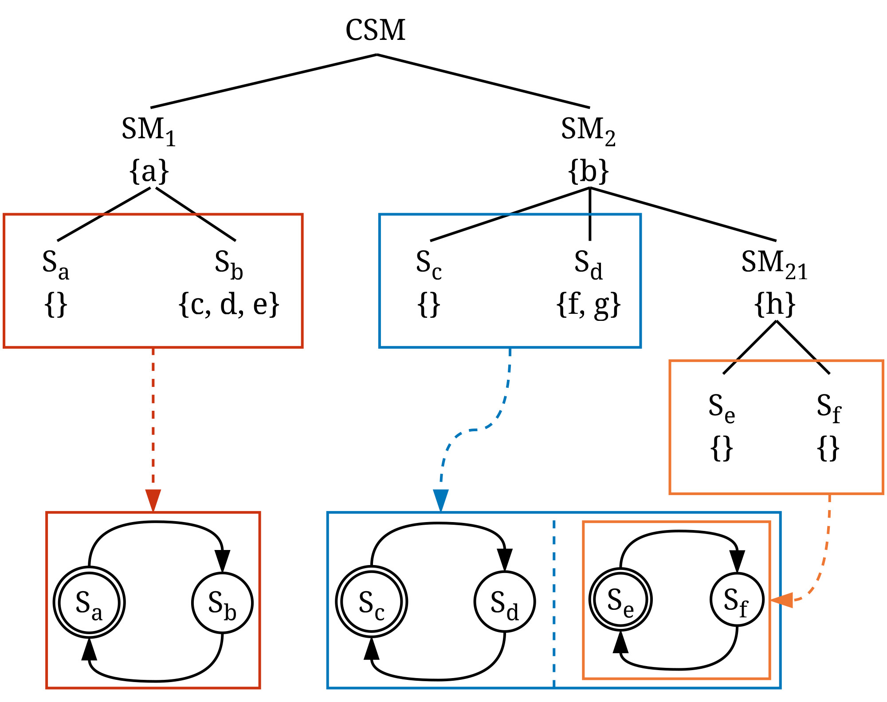
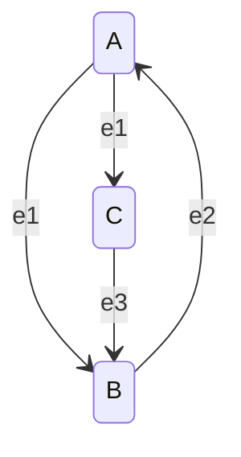

Version 1.0

This document is the Collaborative State Machine language specification.

This specification describes the CSM Language (CSML), its semantics, and its execution model.

## Background

Collaborative State Machines (CSM) is a distributed programming model for the Computing Continuum. CSM
describes distributed applications using state machines deployed onto resources of the Computing Continuum.
With the Computing Continuum, we currently understand the Cloud-Edge-IoT continuum.

Statecharts [(Harel, 1987)](https://www.sciencedirect.com/science/article/pii/0167642387900359), a visual
formalism for the declarative description of complex interactive systems, inspired CSM. Where possible, CSML
is kept consistent with Statecharts. The RHAPSODY semantics of Statecharts
[Harel, 2001](https://link.springer.com/chapter/10.1007/978-3-540-27863-4_19) inspired the execution model
of CSML. [SCXML](https://www.w3.org/TR/scxml/), a markup language that describes state machine execution
environments, provided loose inspiration for CSML. Another inspiration for the CSML is the
[XState](https://xstate.js.org/) framework — a language and runtime for state machine execution environments.

The [Distributed and Parallel Systems Group](https://dps.uibk.ac.at) of the University of Innsbruck created
and maintains CSM. A runtime system implementing CSM and CSML is
[Cirrina](https://git.uibk.ac.at/informatik/dps/dps-dc-software/cirrina).

## Syntax

CSML uses a serialization language such as JSON to serialize a description. In this document, we will make use
of a JSON-inspired language. However, CSML is not strictly bound to JSON.

A CSML description consists of _constructs_, such as those describing a collaborative state machine, state
machine and state. A construct consists of one or multiple _keywords_. When using JSON as a serialization
language, a construct may be an object and a keyword may be a property. Keywords have values of a certain
type.

Code listings contained in this document follow a JSON-inspired notation. However, $\{\ldots constructName\}$
is a placeholder for the construct name. A specific keyword within the construct may be referenced, e.g.,
$\{...constructName.name\}$. Regular expression notation, such as $+$ may be used to indicate that something
must occur at least once, $*$ may be used to indicate that something must occur zero or more times, $(a|b)$
indicates $a$ or $b$, and $(a)?$ indicates that $a$ is optional. Commas are omitted. Single quotes denote
strings. Double quotes surrounding property names are omitted. This syntax is chosen for code listings to
avoid clutter.

## Collaborative State Machine



_Figure 1: An example of a CSM description. Components can have data represented by $\{...\}$._

CSML is used to create CSM _descriptions_. A description represents the static structure of an application
that is executable by a CSM runtime system.

A CSM _description_ takes the form of a tree structure. At its root is a _collaborative state machine_,
encompassing one or more _state machines_. A state machine contains one or more _states_. These fundamental
entities — collaborative state machine, state machines, and states — are called _components_. Every
component can declare _local_ and _persistent_ (globally accessible) data.

Figure 1 above illustrates a CSM tree structure. The presented collaborative state machine has two state
machines, $SM_1$ and $SM_2$, along with a nested state machine denoted as $SM_{21}$. Every state machine
has two _atomic states_. The data variables of all components are represented by $a, \ldots, h$.

### Data

```
({ variables: [ {...variable}* ] } | [ {...variable}* ])
```

_Listing 1: A data construct, since the data construct only has one keyword, it can be shortened to just the_
_list of variables._

A data construct is used to lexically declare data within a certain scope, see
[dynamic extent](#data-model-manipulation-and-scope). Data may be persistent, local, or static. Persistent
data is available persistently throughout and possibly outside the collaborative state machine. Local data is
restricted to a subset of components of the collaborative state machine. Static data is specific to states.

The following keywords can/must be provided in addition to the keywords:

| **Keyword** | **Description**                         | **Type**                      | **Optional** |
| ----------- | --------------------------------------- | ----------------------------- | ------------ |
| variables   | Collection of variables declaring data. | list of [variable](#variable) | No           |

#### Data Variables

The _variables_ keyword is used to declare variables. Their scope and lifetime are bound to the associated
_persistentData_, _localData_, or _staticData_ keyword.

### Variable

```
{
    name: 'var'
    value: {...expression}
}
```

_Listing 2: A variable construct._

A variable declares data, it does so by providing an expression that, when evaluated, results in a data value.

The following keywords can/must be provided in addition to the keywords:

| **Keyword** | **Description**       | **Type**                  | **Optional** |
| ----------- | --------------------- | ------------------------- | ------------ |
| name        | Name of the variable. | string                    | No           |
| value       | Value expression.     | [expression](#expression) | No           |

#### Variable Name

The _name_ keyword specifies the name of the variable. It serves to reference the variable. Whether a variable
is in scope is dependent on how it is declared, see [dynamic extent](#data-model-manipulation-and-scope).
Within a scope, the name of a variable must be unique. The validity of a variable name is
implementation-specific.

#### Variable Value

The _value_ keyword specifies the value expression of the variable. When evaluated, the value expression
yields the variable's (initial) value. Evaluation of a value expression is implementation-specific.

### Variable Reference

```
({ reference: {...variable.name} } | {...variable.name})
```

_Listing 3: A variable reference construct, since the variable reference construct only has one keyword, it_
_can be shortened to just the reference (variable name)._

A variable may be referenced, for instance, to indicate that the output of some action must be written to an
existing variable in scope.

The following keywords can/must be provided in addition to the keywords:

| **Keyword** | **Description**                  | **Type**                        | **Optional** |
| ----------- | -------------------------------- | ------------------------------- | ------------ |
| reference   | Name of the referenced variable. | [variable.name](#variable-name) | No           |

#### Variable Reference Name

The _reference_ keyword specifies the name of the variable that is referenced.

- The variable reference must be an existing variable in scope.

### Expression

```
({ expression: '5+5+v' } | '5+5+v')
```

_Listing 4: An expression construct, since the expression construct only has one keyword, it can be shortened_
_to just the expression string._

An expression represents an evaluable one-line expression that serves to produce an output value. Expressions
are used throughout CSML to represent boolean expressions as well as data expressions. Depending on the
expression language supported by the runtime system implementation, additional functionality may be available,
such as the execution of functions, boolean logic, or arithmetic.

The following keywords can/must be provided in addition to the keywords:

| **Keyword** | **Description** | **Type** | **Optional** |
| ----------- | --------------- | -------- | ------------ |
| expression  | The expression. | string   | No           |

#### Expression

The _expression_ keyword specifies the expression string (source code) that is evaluated to acquire a certain
value. The evaluation of an expression, e.g., the supported syntax, is implementation-specific.

### Guard

```
{
    expression: 'v==5'
    name: 'guard'
}
```

_Listing 5: A guard construct._

A guard is an expression that evaluates to a boolean value. Guards are used within transitions, to determine
whether a transition is taken.

The following keywords can/must be provided in addition to the keywords:

| **Keyword** | **Description**       | **Type** | **Optional**         |
| ----------- | --------------------- | -------- |----------------------|
| expression  | The guard expression. | string   | No                   |

#### Guard Expression

The _expression_ keyword specifies the guard expression.

- The guard expression must evaluate to a boolean value.

### Collaborative State Machine

```
{
    name: 'CSM'
    version: {...version}
    memoryMode: {...memoryMode}
    stateMachines: [
        {...stateMachine}+
    ]
    (localData: {...data})?
    (persistentData: {...data})?
}
```

_Listing 5: A collaborative state machine construct._

State machines draw inspiration from statecharts, emphasizing compatibility with statecharts' features.
Their primary function lies in exhibiting autonomous, event-driven behavior through state transitions.
Actions can occur during transitions, upon entering or exiting a state, and while present in a state.
These actions encompass a range of activities, including invoking computational services, manipulating
data, and raising events. A collaborative state machine goes beyond the singular state machines of
statecharts by modeling an application as a collection of one or more state machines distributed over the
Computing Continuum. State machines are designed to collaborate seamlessly with each other through raising
and handling events, and sharing data. CSM includes a data model spanning _persistent_, _local_, and
_static_ data.

The memory mode specifies the permitted degree of distribution of state machines across the Computing
Continuum. Local and persistent data can be declared through the specification of variables. The data declared
within the description of a component is termed _lexically_ declared, indicating that it is inherently created
as part of the description, as opposed to being _dynamically_ generated based on actions. Data values are
expressions evaluated to acquire a variable's actual value.

The following keywords can/must be provided in addition to the keywords:

| **Keyword**    | **Description**                                 | **Type**                                                | **Optional** |
| -------------- | ----------------------------------------------- | ------------------------------------------------------- | ------------ |
| name           | Name of the collaborative state machine.        | string                                                  | No           |
| version        | CSML version.                                   | [version](#collaborative-state-machine-version)         | No           |
| memoryMode     | Memory mode of the collaborative state machine. | [memory mode](#collaborative-state-machine-memory-mode) | No           |
| stateMachines  | Collection of state machines.                   | list of [state machine](#state-machine)                 | No           |
| localData      | Local data.                                     | [data](#data)                                           | Yes          |
| persistentData | Persistent data.                                | [data](#data)                                           | Yes          |

#### Collaborative State Machine Name

The _name_ keyword specifies the name of the collaborative state machine and may be used for diagnostic
purposes. The validity of a name is implementation-specific. The name of the collaborative state machine is
not referenced within the collaborative state machine and only serves to identify the collaborative state
machine amongst other collaborative state machines.

#### Collaborative State Machine Version

The _version_ keyword specifies the CSML version used within a description and is used to ensure
backward-compatibility. The CSML version is bound to a version of these specifications. A runtime system
implementation's support for varying CSML versions is implementation-specific.

The version is a string enumeration and must be one of the following:

- 1.0

#### Collaborative State Machine Memory Mode

The _memoryMode_ keyword specifies the [memory mode](#memory) of the complete collaborative state machine. The
memory mode applies to the entire collaborative state machine.

The memory mode is a string enumeration and must be one of the following:

- distributed
- shared

#### Collaborative State Machine State Machines

The _stateMachines_ keyword is used to specify the collection of state machines included in the collaborative
state machine.

- At least one state machine must be declared.

#### Collaborative State Machine Local/Persistent Data

The _localData_ and _persistentData_ keywords allow for _lexically_ declaring respectively the local
and persistent data at the collaborative state machine level. Depending on the memory mode of the
collaborative state machine, either or both types of data will be accessible within the collaborative state
machine, see [dynamic extent](#data-model-manipulation-and-scope).

### State Machine

```
{
    name: 'SM2'
    states: [
        {...(state)}+
    ]
    stateMachines: [
        {...(stateMachine)}+
    ]
    (localData: {...data})?
    (persistentData: {...data})?
}
```

_Listing 6: A state machine construct._

The purpose of state machines is to model event-driven execution behavior in the Computing Continuum by
enabling the transitioning between states or accommodating nested state machines. Nested state machines
allow for expressing concurrent behavior within a state machine, enabling observation and intervention in the
execution behavior of the parent state machine. They start simultaneously with the parent state machine. A
state machine can contain one or more states that can be reached through state transitions. At any given time, only one
state within a state machine is considered active, rendering all other states within that state machine
inactive. Like the collaborative state machine, local and persistent data can be declared.

The following keywords can/must be provided in addition to the keywords:

| **Keyword**    | **Description**                         | **Type**                                | **Optional** |
|----------------|-----------------------------------------|-----------------------------------------| ------------ |
| name           | Name of the state machine.              | string                                  | No           |
| states         | Collection of states.                   | list of [state](#state)                 | No           |
| stateMachines  | Collection of state machines.           | list of [state machine](#state-machine) | No           |
| localData      | Local data.                             | [data](#data)                           | Yes          |
| persistentData | Persistent data.                        | [data](#data)                           | Yes          |

#### State Machine Name

The _name_ keyword specifies the name of the state machine and may be used for diagnostic purposes or
referencing. The validity of a name is implementation-specific. The name of a state machine is not referenced
inside a description. However, depending on the runtime system implementation, a state machine may be
addressed using its name at runtime

#### State Machine States

The _states_ keyword is used to specify the collection of atomic states included in the state machine. Atomic 
states are described using the [state](#state) construct.

- At least one state must be declared.
- [State names](#state-name) must be unique.
- Exactly one [initial state](#state-initial) must be declared.
- Initial states must not have inward transitions.
- Terminal states must not have outward transitions.
- Every state must be reachable (it must have a transition leading into it, or it must be the initial state).

#### State Machine Nested State Machines

The _stateMachines_ keyword is used to specify the collection of nested state machines. Nested state machines 
are described using the [state machine](#state-machine) construct.

#### State Machine Local/Persistent Data

The _localData_ and _persistentData_ keywords allow for _lexically_ declaring respectively the local and
persistent data at the state machine level. Data described at the state machine level is accessible from the
state machine and any component hierarchically below it, see
[dynamic extent](#data-model-manipulation-and-scope).

### State

```
{
    name: 'Sd'
    (initial: (true|false))?
    (terminal: (true|false))?
    (entry: [
        {...(action)}*
    ])?
    (exit: [
        {...(action)}*
    ])?
    (while: [
        {...(action)}*
    ])?
    (after: [
        {...(action)}*
    ])?
    (on: [
        {...(onTransition)}*
    ])?
    (always: [
        {...(transition)}*
    ])?
    (localData: {...data})?
    (persistentData: {...data})?
    (staticData: {...data})?
}
```

_Listing 7: A state construct._

A state represents a potentially active state, which can be activated by entering through a state transition
and can be _initial_, _terminal_, or neither (intermediate). There must be exactly one initial state within a
state machine. A terminal state, of which multiple can exist, indicates the end of the lifecycle of the
containing state machine. State transitions are specified as _always_ or _on_ transitions. Always
transitions, possibly guarded with expressions, are taken without events, similar to the non-event-driven
transitions between the tasks of workflows. On-event transitions drive the event-driven nature of state
machines, allowing a state transition based on a received event. Events may be generated from the state
machine itself, other state machines, as well as from the environment external to CSM (for instance, an
external application or device). Actions executed in a state include _entry_ and _exit_ actions upon entering
or exiting the state. _While_ actions are executed while the state is active. Timed actions are declared
using the _after_ keyword. Actions can either be referenced by name or can be declared in-line. Like previous
constructs, a state allows for lexically declaring local, static, and persistent data. An additional type of
data, _static_ data, utilizes the capability of the state for re-entry, allowing data to retain their values
between exiting and re-entering the state.

The following keywords can/must be provided in addition to the keywords:

| **Keyword**    | **Description**             | **Type**                                          | **Optional** |
| -------------- | --------------------------- |---------------------------------------------------| ------------ |
| name           | Name of the state.          | string                                            | No           |
| initial        | Initial flag of the state.  | boolean                                           | Yes          |
| terminal       | Terminal flag of the state. | boolean                                           | Yes          |
| entry          | Entry actions.              | list of [action](#action)                         | Yes          |
| exit           | Exit actions.               | list of [action](#action)                         | Yes          |
| while          | While actions.              | list of [action](#action)                         | Yes          |
| after          | After actions.              | list of [timeout action](#timeout-reset-action)   | Yes          |
| on             | On event transitions.       | list of [on-transition](#on-transition)           | Yes          |
| always         | Always transitions.         | list of [transition](#transition)                 | Yes          |
| localData      | Local data.                 | [data](#data)                                     | Yes          |
| persistentData | Persistent data.            | [data](#data)                                     | Yes          |
| staticData     | Static data.                | [data](#data)                                     | Yes          |

#### State Name

The _name_ keyword specifies the name of the state and may be used for diagnostic purposes or referencing.
The validity of a name is implementation-specific. A state's name is referenced throughout the state machine
to indicate the transition target.

#### State Initial

The _initial_ keyword specifies whether a state is the initial state of the containing state machine.

- Exactly one [initial state](#state-initial) must be declared.
- Initial states must not have inward transitions.

#### State Terminal

The _terminal_ keyword specifies whether a state is a terminal state of the containing state machine.

- Multiple states may be declared [terminal](#state-terminal).
- Terminal states must not have outward transitions.

#### State Entry/Exit/While/After

The _entry_ keyword specifies the actions executed upon entry of the state. The _exit_ keyword specifies the
actions executed upon exiting the state. The _while_ keyword specifies the actions executed while in a
state. The _after_ keyword specifies the actions executed upon a timeout. Actions may be declared
in-line, in which case an action name is not required. Actions may also be referenced by name. Actions
executed within a state have state scope, see [dynamic extent](#data-model-manipulation-and-scope).

- An action reference must be a valid action name.

#### State On

The _on_ keyword specifies the transitions that can occur based on events.

- The referenced event in an on-transition must be raised within the collaborative state machine.

#### State Always

The _always_ keyword specifies the transitions that can occur regardless of raised events.

#### State Local/Persistent Data

The _localData_, _persistentData_, and _staticData_ keywords allow for _lexically_ declaring respectively the
local, persistent, and static data at the state machine level. Static data is unique to states and is
available after re-entry of a state. Data described at the state level is accessible from the state machine
and any component hierarchically below it, see [dynamic extent](#data-model-manipulation-and-scope).

### Event

```
{
    name: 'e1'
    channel: {...eventChannel}
    (data: [
        {...variable}*
    ])?
}
```

_Listing 8: An event construct._

Events are raised and handled by state machines in the collaborative state machine and are matched based on
their name. Events fall into three categories: _internal_, _external_, and _global_. Internal events are
exclusively handled by the state machine that raised them and not seen by other state machines. External
events are received by state machines that have subscribed to the events raised by other state machines. This
linkage introduces decentralization, allowing state machines to dynamically subscribe to events of interest
raised by other state machines. For instance, consider Edge devices expressing interest in events raised by
connected IoT devices. The subscription to events from 'connected' IoT devices exemplifies the concept of
external events. Global events are not tied to any specific source state machine and are universally seen by
every state machine. This universal handling establishes a global communication channel within the
application. A raised event may contain data transmitted to the receiver; an expression is used to gather the
data to include with the event. When a state machine processes the received event and takes a transition, the 
event data is assigned to the current state's [dynamic extent](#data-model-manipulation-and-scope) using the 
name and value of each provided context variable. This overrides existing variables or creates new variables 
if they don't exist within the dynamic extent.

The following keywords can/must be provided in addition to the keywords:

| **Keyword** | **Description** | **Type**                        | **Optional** |
| ----------- | --------------- | ------------------------------- | ------------ |
| name        | Event name.     | string                          | No           |
| channel     | Event channel.  | [event channel](#event-channel) | No           |
| data        | Event data.     | list of [variable](#variable)   | Yes          |

#### Event Name

The _name_ keyword specifies the event name. Events are matched according to their name. The validity of the
event name is implementation-specific. Event names may be re-used.

#### Event Channel

The _eventChannel_ keyword specifies the event channel of the raised event.

The event channel is a string enumeration and must be one of the following:

- internal
- external
- global

#### Event Data

The _data_ keyword specifies the event data contained within the event. Event data will be assigned to the
[dynamic extent](#data-model-manipulation-and-scope) of the state machine's current state which processes 
the event and takes a transition.

Event data can be accessed inside expressions by their variable names, with event data variables prefixed by a _$_ to indicate their special status compared to context variables. The lifetime of event data is bound to the transition following the event and any subsequently executed actions.

### Transition

```
{
    target: {...state.name}
    (guards: [
        {...(guard.name|guard)}*
    ])?
    (actions: [
        {...(action.name|action)}*
    ])?
    (else: {...state.name})?
}
```

_Listing 9: A transition construct._

A state transition enables the transitioning between the states of a state machine. The result of a state
transition is exiting the currently active state and entering the newly active state. CSML supports _external_
transitions, using the _target_ keyword to specify a target state towards which the transition is
directed within the same state machine. A state may externally transition into itself by declaring a
transition with its state name. Optionally, the target state may be omitted, leading to an _internal_
transition. In this case, the state machine stays in its current state, bypassing the execution of any actions
triggered by entering or exiting a state while still carrying out the transition actions. Guard conditions are
provided as expressions in the context of transitions. A guard expression
$E : \mathbb{R}^n \to \{\text{true}, \text{false}\}$ takes the form where $\mathbb{R}^n$ represents the
domain, consisting of all variables in scope, see [dynamic extent](#data-model-manipulation-and-scope).
To initiate a transition, the conjunction of all guard expressions must collectively be evaluated to true.
The _actions_ keyword is used to specify the actions executed when the transition is taken.

- Transitions must be mutually exclusive.

The following keywords can/must be provided in addition to the keywords:

| **Keyword** | **Description**     | **Type**                    | **Optional** |
| ----------- | ------------------- |-----------------------------| ------------ |
| target      | Target state name.  | [state name](#state-name)   | No           |
| guards      | Guard conditions.   | list of [guard](#guard)     | Yes          |
| actions     | Transition actions. | list of [action](#action)   | Yes          |
| else        | Else target.        | [state name](#state-name)   | Yes          |

#### On-Transition

```
{
    event: {...event.name}
    target: {...state.name}
    (guards: [
        {...(guard.name|guard)}*
    ])?
    (actions: [
        {...(action.name|action)}*
    ])?
    (else: {...state.name})?
}
```

_Listing 10: An on-transition construct._

The on-transition construct is a specialization of the transition construct, adding the _event_ keyword that
specifies the event that triggers the transition.

The following keywords can/must be provided in addition to the keywords:

| **Keyword** | **Description**      | **Type** | **Optional** |
| ----------- | -------------------- | -------- | ------------ |
| event       | Event responding to. | string   | No           |

#### Transition Target

The _target_ keyword specifies the [state name](#state-name) to transition into.

- The target state name must be valid.

#### Transition Guards

The _guards_ keyword specifies the guard conditions of the transition. All guard expressions must evaluate to
boolean true for the transition to be taken.

- The guard expression must evaluate to boolean true or false.

#### Transition Actions

The _actions_ keyword specifies the actions executed as part of the transition. Actions may be declared
in-line, in which case an action name is not required. Actions may also be referenced by name. Actions
executed within a state have state-scope, see [dynamic extent](#data-model-manipulation-and-scope).

- An action reference must be a valid action name.

#### Transition Else

The _else_ keyword specifies the state to transition into, should the guard condition not evaluate to boolean
true.

- The else state name must be valid.

#### On-Transition Event

The _event_ keyword specifies the name of an event that triggers the on-transition.

- The name of the event must be an event raised within the collaborative state machine.

### Action

Various types of action constructs exist in CSML. The following sections specify each.

#### Invoke Action

```
{
    type: 'invoke'
    serviceType: 'serviceTypeName'
    (local: (true|false))?
    (input: [
        {...variable}*
    ])?
    (output: [
        {...variableReference}*
    ])?
    (done: [
        {...event}*
    ])?
    (properties: [
        {...property}*
    ])
}
```

_Listing 11: An invoke action construct._

An invoke action allows invoking a defined _service type_. In this context, 'type' in 'service type' refers to
the service abstraction of CSML. When invoking a service type, the description does not explicitly define a
specific implementation of a service. Instead, a service type may encompass multiple variations of a
particular service which can be implemented differently; for instance, they could use different algorithms,
optimize for varying computational resources, or use approximate methods for computational operations to save
costs. The decision on the exact implementation to use within a given context is left to the underlying
runtime system implementation, which can make informed decisions based on the available information of the
user or environment (e.g., to optimize for different performance objectives). The _properties_ keyword
facilitates the specification of hints (e.g., estimated runtime or memory requirements) to the runtime system,
which can use it, for instance, to steer the selection of a particular service implementation. Input data for
the service type invocation can be provided as one or multiple expressions, specified alongside the _input_
keyword. To handle actions executed after the invocation of the service type, _done_ events can be declared.
In handling these events, the output data of the invoked service is available for storage, passing to
subsequent invocations/events or other actions. A true value alongside the _local_ keyword indicates to a
runtime system implementation that the service should be invoked locally (on the resource where the state
machine is executed) if possible. In case the keyword is omitted or has the value false, the service
invocation occurs remotely, possibly on another resource.

The following keywords can/must be provided in addition to the keywords:

| **Keyword** | **Description**        | **Type**                                          | **Optional**          |
| ----------- | ---------------------- |---------------------------------------------------| --------------------- |
| type        | Type of action.        | string                                            | No                    |
| serviceType | Service type name.     | string                                            | No                    |
| local       | Local execution flag.  | boolean                                           | Yes                   |
| input       | Input data.            | list of [variable](#variable)                     | Yes                   |
| output      | Output data reference. | list of [variable reference](#variable-reference) | Yes                   |
| done        | Done events.           | list of [event](#event)                           | Yes                   |
| properties  | Runtime hints.         | list of property                                  | Yes                   |

##### Invoke Action Service Type

The _serviceType_ keyword specifies the invoked service type. The service type is provided as a string value,
it is up to the runtime system implementation to determine the validity of the service type name or to
provide a naming schema for service types.

##### Invoke Action Local

The _local_ keyword provides a hint to the runtime system implementation that the service type is intended to
be invoked locally, in case of boolean true. Otherwise, it is not specified where the runtime system
implementation should invoke the service type.

##### Invoke Action Input

The _input_ keyword specifies the input to the invoked service type.

##### Invoke Action Output

The _output_ keyword specifies context variables where the output of the invoked service type should be stored. 
This is done by matching context variables received as output from the service invocation with the output 
references defined using this keyword. Variable references can be local, static or persistent context variables.

##### Invoke Action Done

The _done_ keyword specifies the events raised after invocation. Raising done events allows for asynchronous
service type invocation, allow transitioning into subsequent states whenever the service type invocation has
been completed.

##### Invoke Action Properties

The _properties_ keyword specifies hints provided to the runtime system implementation to direct the
invocation. Hints may, for example, indicate among several service implementations, the service to select.
The supported hints and specifications are runtime system implementation-specific.

#### Data Action

```
{
    type: 'create'
    variable: {...variable}
    (persistent: (true|false))?
}

{
    type: 'assign'
    variable: {...variableReference}
    value: {...expression}
}

{
    type: 'delete'
    variable: {...variableReference}
}
```

_Listing 12: A create, assign, and delete action construct._

Data manipulation actions enable the dynamic creation of variables as local or persistent data, the assignment
of values to existing variables, and the deletion of variables. When creating a variable, the _persistent_
keyword is used to specify whether the variable should be created persistently. In case the keyword is omitted
or has the value false, the variable is locally created in the current scope.

The following keywords can/must be provided in addition to the keywords (create action construct):

| **Keyword** | **Description**                      | **Type**              | **Optional**          |
| ----------- | ------------------------------------ |-----------------------| --------------------- |
| type        | Type of action.                      | string                | No                    |
| variable    | Variable to create.                  | [variable](#variable) | No                    |
| persistent  | Whether to create data persistently. | boolean               | Yes                   |

The following keywords can/must be provided in addition to the keywords (assign action construct):

| **Keyword** | **Description**                  | **Type**                                  | **Optional**          |
| ----------- | -------------------------------- | ----------------------------------------- | --------------------- |
| type        | Type of action.                  | string                                    | No                    |
| variable    | Variable reference to assign to. | [variable reference](#variable-reference) | No                    |
| value       | Value expression.                | [expression](#expression)                 | No                    |

The following keywords can/must be provided in addition to the keywords (delete action construct):

| **Keyword** | **Description**               | **Type**                                  | **Optional**          |
| ----------- | ----------------------------- | ----------------------------------------- | --------------------- |
| type        | Type of action.               | string                                    | No                    |
| variable    | Variable reference to delete. | [variable reference](#variable-reference) | No                    |

##### Data Action Variable

The _variable_ keyword specifies the variable to create or the variable reference to manipulate.

- When creating a variable, the variable must not exist.
- When manipulating an existing variable, the variable must exist.

##### Data Action Persistent

The _persistent_ keyword specifies, for a create action, whether the variable needs to be created
persistently. In case it must, the variable is created in the persistent data. Otherwise, the variable is
locally created in the current scope.

##### Data Action Value

The _value_ keyword specifies the value expression for an assign action. The expression is evaluated to
acquire the data value assigned to the variable.

#### Raise Event Action

```
{
    type: 'raiseEvent'
    event: {...event}
}
```

_Listing 13: A raise event action construct._

The raise event action enables a state machine to raise an event that is subsequently handled by another state
machine or the state machine itself.

The following keywords can/must be provided in addition to the keywords (raise action construct):

| **Keyword** | **Description**     | **Type**        | **Optional**          |
| ----------- | ------------------- | --------------- | --------------------- |
| type        | Type of action.     | string          | No                    |
| event       | The event to raise. | [event](#event) | No                    |

##### Raise Event Action Event

The _event_ specifies the event to raise within the collaborative state machine.

#### Timeout (Reset) Action

```
{
    delay: {...expression},
    actions: [
        {...action}*
    ]
}

{
    action: {...action.name}
}
```

_Listing 14: A timeout and timeout reset action construct._

A special type of action, the _timeout_ action, is used in conjunction with the _after_ keyword introduced
earlier in this section. The timeout action specifies a delay, after which the specified action is executed.
The provided action must be a raise event action so subsequent behavior can be triggered upon a raised event.
Timeouts can be reset based on the _reset timeout_ action.

The following keywords can/must be provided in addition to the keywords (timeout action construct):

| **Keyword** | **Description**     | **Type**                    | **Optional**          |
| ----------- | ------------------- |-----------------------------| --------------------- |
| type        | Type of action.     | string                      | No                    |
| delay       | The event to raise. | [expression](#expression)   | No                    |
| actions     | The event to raise. | list of [action](#action)   | No                    |

The following keywords can/must be provided in addition to the keywords (timeout reset action construct):

| **Keyword** | **Description**              | **Type**                    | **Optional**          |
| ----------- | ---------------------------- | --------------------------- | --------------------- |
| type        | Type of action.              | string                      | No                    |
| action      | The timeout action to reset. | [action name](#action-name) | No                    |

##### Timeout Action Delay

The _delay_ keyword specifies the delay expression evaluated to provide the delay value. The delay value is
specified in milliseconds.

- The delay expression must be evaluated to a numeric value.

##### Timeout Action Actions

The _actions_ keyword specifies the actions to execute upon the timeout. The actions provided must necessarily
be raised event actions to not interfere with the execution of a state machine, but instead, handle any
subsequently executable behavior within the state machine's execution behavior.

- The actions provided as timeout actions must be raise event actions.

##### Timeout Reset Action Action

The _action_ keyword specifies the timeout action to reset. The action referenced must be a previously
executed timeout action.

- The action reference provided must be a previously executed timeout action.

## Memory

A collaborative state machine operates within one of two distinct memory modes: _shared_ and _distributed_.
Hereafter, we denote the tree representing the CSM description as $C$. Moreover, we let $c$ represent any
component in $C$ and $s$ specifically represent a state machine component. In shared memory mode, each $c$
is confined to a computing resource with the same shared memory. Conversely, in distributed memory mode,
each $s$ can be executed on different resources, each equipped with its private memory. Thus these
components run on a computing infrastructure with distributed memory. A single state machine operates
exclusively in shared memory mode. The decision to opt for distributed or shared memory modes may have
far-reaching implications. Opting for distribution presents advantages such as heightened parallelism,
scalability, replication, and decentralization. However, this may result in increased data transfer times
when data has to be exchanged between state machines executed on different resources.

## Data Model, Manipulation and Scope

The scoping of local data within a collaborative state machine is defined with respect to the _dynamic extent_
of the components of $C$ with shared memory. We denote the dynamic extent of a component $c$ as $c^+$ to
include the component itself and any ancestor of $c$. When operating in shared memory mode, $C$ is guaranteed
to execute on a single resource with shared memory such that any component $c \in C$ can access local data
according to $c^+$ and $c_0^+$ where $c_0$, the root level, denotes the collaborative state machine. The root
of a collaborative state machine in distributed memory mode has no shared memory and thus cannot declare or
access local data. A state machine $s$ with its nested components $s_{c}$ always operates in shared memory
even if $s$ is part of $C$ in distributed memory. $s$ has access to local data according to $s^+$. Similarly,
each component $s_{c}$ has a dynamic extent denoted by $s_{c^+}$, allowing access to its local data within its
specific scope, as illustrated in Figure 1. Restricting the access of data to ancestors facilitates
information hiding. For example, a state can access the data of its parent state machine, but a state machine
cannot access the data of its states or nested state machines. In Figure 1 state $S_{e}$ has access to
variables $h$ and $b$, state $S_a$ can access $a$, and state $S_b$ can access variables $c$, $d$, $e$, and
$a$. However, $SM_2$ can only access variable $b$. Siblings do not have access to each other's data. For
instance, $S_{d}$ cannot access any data within $SM_{21}$ or $S_{c}$.

When referencing an existing variable within a component $c$, the variable is located by searching within the
dynamic extent $c^+$, which encompasses the local data of $c$ and extends to include any ancestor components
of $c$. The search proceeds from the local data of $c$ to the local data of its ancestors, and finally to
persistent data accessible to the component and its ancestors.

Within CSM, data plays a multifaceted role. Data may be declared lexically or created dynamically, and data
can be manipulated through actions. Data may be stored locally within a component or persisted globally.
Expressions provide fundamental data transformation operations, such as selecting properties from JSON
objects, performing calculations or filtering, and invoking utility functions. The versatility of expressions
extends to their usage in diverse scenarios. For example, expressions can facilitate gathering input data for
service invocations, express guard conditions, or be instrumental in manipulating data objects directly.

## Execution Model

This section will define the CSM execution model. The execution model is defined as the execution of an
individual state machine. A collaborative state machine containing multiple (nested) state machines will
concurrently execute each individual state machine according to the execution model.

A state machine instance is associated with a _status_ $\mu = \langle c^+, \Epsilon, \Theta \rangle$ that
captures its current situation, including its dynamic extent $c^+$, input events $\Epsilon$, and
_active configuration_ $\Theta$.

The _active configuration_ $\Theta$ of the state machine is the set of states $s \in S$ that are currently
_active_. The _CSM step algorithm_ aims to produce a new status according to changes in the state machine's
environment that the state machine responds to.

The step algorithm reaches a new status by performing a _step_. We say that a step consists of an arbitrary
number of _micro-steps_ and that a step is completed yielding a new status whenever no micro-step exists for
the executed step.

The CSM execution model adheres to the following principles:

1. Changes that occur during a step are effective immediately.
2. An event is available during one step only and becomes unavailable upon completion of the step where it is
   handled.
3. A state machine is considered alive if the active configuration contains no terminal state.
4. The execution of a step and a micro-step may take time.
5. Actions defined are executed sequentially; a successive action is executed when the preceding action is
   completed.
6. One state must be active in the active configuration.

Principle 1 serves to ensure that changes to the state machine's status take effect immediately, avoiding
non-determinism by committing changes without delay, thus maintaining consistency and predictability in the
state machine's behavior.

Principle 2 serves to prevent redundant processing of events within a single step, ensuring that each event is
handled exactly once. By making events unavailable after processing in a step, this principle maintains the
integrity of event-driven behavior and avoids potential inconsistencies.

Principle 3 serves to define the lifetime of a state machine based on the absence of terminal states in its
active configuration. By considering a state machine alive if it has states to transition through, this
principle ensures that execution continues until a terminal state is reached, maintaining the ongoing
functionality of the state machine.

Principle 4 serves to acknowledge the potential time consumption during the execution of steps and
micro-steps. By recognizing that execution may take time, this principle allows for accommodating delays
caused by various factors, ensuring that the execution model remains robust and capable of handling
real-world scenarios where computational or external dependencies may affect execution time.

Principle 5 serves to enforce the sequential execution of actions defined within the state machine. By
ensuring that each action is executed only after the completion of the preceding action, this principle
maintains determinism and prevents race conditions or inconsistencies that could arise from concurrent
execution of actions, thereby preserving the integrity of state transitions and overall system behavior.

Principle 6 serves to avoid non-determinism, i.e., $|\{s \in \theta ∣ s \text{ is active}\}|=1$, by enforcing
that only one state can be active in the active configuration at any given time. By ensuring that the active
configuration always contains exactly one active state, this principle prevents ambiguity in state transitions
and guarantees predictable behavior within the state machine.

### Step Algorithm

We define the step algorithm as follows.

**procedure** _ExecuteStep_

- **Input** Given the status $\mu$ of a state machine.
- **Ouput** Provide a new status $\mu$ of the state machine.

1. $\textbf{while } \Theta \neq \emptyset \textbf{ do}$
   1. $x \leftarrow \text{Pop(}\Theta\text{)}$
   2. $\text{Handle(}x, \mu\text{)}$

Here, _1.1_ ensures that events in the event queue are removed before handling, and _1.2_ ensures that the
status is updated according to the behavior that follows from events in the event queue.

Before executing a single step, $\Theta$ is updated with respect to any input events in the environment or
collaborative state machine. External events, provided by the environment, are added to $\Theta$ before the
execution of a step. Timeout events are treated as external events.

We define the _Handle_ procedure as follows.

**procedure** _Handle_

- **Input** Given an input event $x$ and status $\mu$.
- **Output** Provide an updated status $\mu$ according to the event.

1. Select the active _on_ transition $t$, given $x$ and $\mu$, or $\emptyset$ in case no active _on_
   transition exists.
2. $\textbf{while } \delta \neq \emptyset \textbf{ do}$
   1. If $\delta$ is an external transition.
      1. Cancel any _while_ actions of the states exited due to $\delta$.
      2. Execute the _exit_ actions of the states exited due to $\delta$.
      3. Execute the actions of $\delta$.
      4. Execute the _entry_ actions of the states entered due to $\delta$.
      5. Execute the _while_ actions of the states entered due to $\delta$.
      6. Update the activate configuration.
      7. Set $\delta$ the active _always_ transition or $\emptyset$ in case no active _always_ transition exists.
   2. Otherwise.
      1. Execute the actions of $\delta$.

An _on_ transition is selected (active) iff its source state (the state from which the transition starts) is
the active state, its guard conditions evaluates to true, and $x$ is the event that would trigger the
transition.

An _always_ transition is selected iff its source state (the state from which the transition starts) is the
active state and its guard condition evaluates to true.



The selection of a transition must yield exactly one transition. Conflicts arise whenever one event dictates
that the state machine should make two atomic states active. This is invalid and will result in
non-determinism.

In the example above, a conflict would arise when the active state is _A_ and _e1_ would be raised.

<script type="text/javascript" src="http://cdn.mathjax.org/mathjax/latest/MathJax.js?config=TeX-AMS-MML_HTMLorMML"></script>

<script type="text/x-mathjax-config">
    MathJax.Hub.Config({ tex2jax: {inlineMath: [['$', '$']]}, messageStyle: "none" });
</script>
